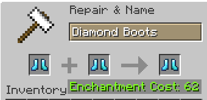

# No Anvil Limit

A Minecraft Fabric mod that removes the anvil "Too Expensive!" level 40 cap, allowing unlimited enchantment combinations and repairs.

## Features

- Removes the level 40 limit from anvils.
- Combine highly-enchanted items and repair gear without ever hitting "Too Expensive!".
- Create enchantment combinations that were previously impossible in survival.
- Works in singleplayer and on servers.



## Usage

Install the mod and use anvils as normal — the level 40 restriction is simply gone, so any valid combine or repair goes through regardless of its XP level cost.

## Installation

1. Install [Fabric Loader](https://fabricmc.net/use/installer/)
2. Install [Fabric API](https://modrinth.com/mod/fabric-api)
3. Download the mod from [Modrinth](https://modrinth.com/mod/no-anvil-limit) or the Releases page
4. Place the jar in your `mods` folder

## Building

```bash
./gradlew clean build
```

The built jar lands in `build/libs/`. To run a dev client, use `./gradlew runClient`.

## Compatibility

- Minecraft: 26.2
- Fabric Loader: 0.19.3+
- Fabric API: 0.158.0+26.2

## License

This mod is licensed under the MIT License. See [LICENSE](LICENSE) for details.
